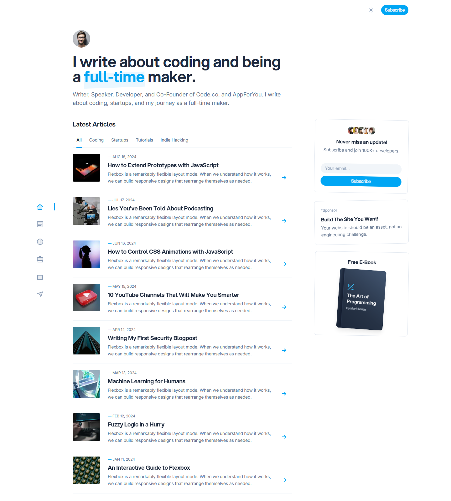

# DevSpace theme

_DevSpace_ is a theme for [Cecil](https://cecil.app), ported from the [DevSpace](https://cruip.com/) HTML template by [Cruip](https://cruip.com), and powered by [Tailwind CSS](https://tailwindcss.com).



A personal blog and portfolio: icon-only side navigation, light/dark switch, configurable sidebar widgets, and ready-made layouts for a homepage, posts, projects, a resume and a newsletter page.

## Installation

Download the theme and uncompress its content in `themes/devspace`.

## Usage

Add `devspace` to the `theme` section of your `config.yml`:

```yaml
theme:
  - devspace
```

### Build the CSS

The theme ships with a pre-built `assets/styles.css`. Rebuild it after changing a template or a style:

```bash
composer install
composer css:build   # or `composer css:watch`
```

The CSS is compiled with [Tailwind Builder](https://github.com/ArnaudLigny/tailwind-builder), a Composer package running the Tailwind standalone binary: no Node.js nor npm required.

Tailwind scans `themes/devspace/layouts/**/*.twig` **and** your site's `layouts/**/*.twig` (see `@source` in `assets/tailwind.css`).

## Configuration

All options live under the `devspace` key. Defaults are in the theme's `config.yml`.

```yaml
devspace:
  avatar: images/me.jpg          # asset path; shown in the side navigation and the homepage hero
  copyright: 'Your name'         # footer copyright holder (default: site title)
  filters: categories            # vocabulary used as filter tabs above the posts list (false to disable)
  icons:                         # overrides the side navigation icon of a menu entry, by entry ID
    blog: blog                   # available: home, blog, about, projects, resume, subscribe
  posts:
    section: blog                # section used as source of the posts listed on the homepage
    title: Latest Articles
    max: 8
  search:                        # optional: displays a search form in the header
    url: /search
    param: q
  button:                        # optional: displays a call to action button in the header
    name: Subscribe
    url: /subscribe
  share: [x, facebook, linkedin] # share buttons of a post (also: telegram, email)
  social:                        # footer links (available icons below)
    x: https://x.com/…
    github: https://github.com/…
    rss: /blog/atom.xml
  widgets: [newsletter, sponsor, ebook]
```

Available social icons: `x`, `github`, `youtube`, `telegram`, `facebook`, `linkedin`, `mastodon`, `instagram`, `rss`, `email`.

### Navigation

The side navigation is built from the `main` menu, so give your pages a short menu name:

```yaml
---
title: Nice stuff I've built
menu:
  main:
    name: Projects
    weight: 40
---
```

The icon is picked from the menu entry ID (i.e. the page ID): `index` uses the _home_ icon, and `blog`, `about`, `projects`, `resume` and `subscribe` use theirs. Map any other ID with `devspace.icons`.

### Sidebar widgets

`devspace.widgets` lists the widgets displayed in the right sidebar, in order. A page can override the list (and any widget's data) in its front matter:

```yaml
---
title: My resume
widgets: [skills, languages, references]
skills:
  title: Technical Skills
  items:
    - name: React
      level: 90
---
```

| Widget       | Data                                                                                   |
|--------------|----------------------------------------------------------------------------------------|
| `newsletter` | `title`, `text`, `button`, `action`, `method`, `param`, `avatars` (list of asset paths) |
| `sponsor`    | `label`, `title`, `text`, `url`, `image`                                                |
| `ebook`      | `title`, `image`, `url`                                                                 |
| `popular`    | `title`, `max`, `pages` (list of page IDs; else pages with `popular: true`)              |
| `skills`     | `title`, `items` of `name` + `level` (0-100)                                            |
| `languages`  | `title`, `items` of `name` + `flag` + `level` (0-100)                                   |
| `references` | `title`, `items` of `name` + `text` + `image` + `url`                                   |

## Layouts

| Layout               | Used for                                                                 |
|----------------------|--------------------------------------------------------------------------|
| `index`              | the homepage: hero, latest posts, and card sections                      |
| `_default/page`      | a standard page: title, image, content, and `sections`                   |
| `_default/list`      | section and taxonomy term pages                                          |
| `_default/vocabulary`| the list of terms of a vocabulary                                        |
| `_default/404`       | the "page not found" page                                                |
| `post`               | a blog post (`blog/page` extends it)                                     |
| `projects`           | `layout: projects` — groups of cards                                     |
| `resume`             | `layout: resume` — timelines                                             |
| `subscribe`          | `layout: subscribe` — pitch, benefits, form and testimonials             |

### Homepage

```yaml
---
title: "I write about coding and being a full-time maker."
highlight: full-time   # word of the title to highlight
pagination: false      # the homepage lists the latest posts, not a paginated collection
sections:
  - title: Popular Talks
    type: video        # `video` (a thumbnail with a play button) or `project` (default)
    cards:
      - title: The Third Age of JavaScript
        image: images/popular-post-01.jpg
        url: '#'
---
The body of `index.md` is used as the hero introduction.
```

### Posts

Posts of the `blog` section use the `post` layout. If your posts live in another section, either map it:

```yaml
layouts:
  sections:
    articles: blog
```

…or set `layout: post` in the front matter of the pages concerned.

A post uses `image` as its cover, `date`, the configured taxonomies for its terms, and `popular: true` to appear in the `popular` widget.

### Cards

Used by the homepage, the `projects` layout and the `subscribe` layout:

```yaml
sections:
  - title: Side Hustles
    cards:
      - title: Container Tinkering
        text: Solutions for running containers locally and remotely.
        url: 'https://example.com'
        icon: images/project-icon-01.svg  # small icon in a bordered circle
        avatar: images/testimonial-01.jpg # or a rounded avatar
        badge: Open-Source
```

### Timelines

Used by the `resume` layout, and by any page rendered with `_default/page`:

```yaml
sections:
  - title: Work Experience
    timeline: true   # draws the vertical line between items (default)
    items:
      - date: May 2020 · Present
        title: Senior Front-end Engineer
        subtitle: Google
        text: In my role as a Senior Software Engineer…
        image: images/logo-google.svg
        rounded: false   # true to display the image as an avatar
```

## Internationalization

The theme supports [localization](https://cecil.app/documentation/templates/#localization) and provides English and French translations (see `translations/`).

```yaml
languages:
  - code: fr
    locale: fr_FR
```

## License

The _DevSpace_ HTML template is governed by the [Cruip premium license](https://cruip.com/terms/); this Cecil port inherits it. You need a Cruip license to use it.

© [Cruip](https://cruip.com) for the design, [Arnaud Ligny](https://arnaudligny.fr) for the Cecil port.
